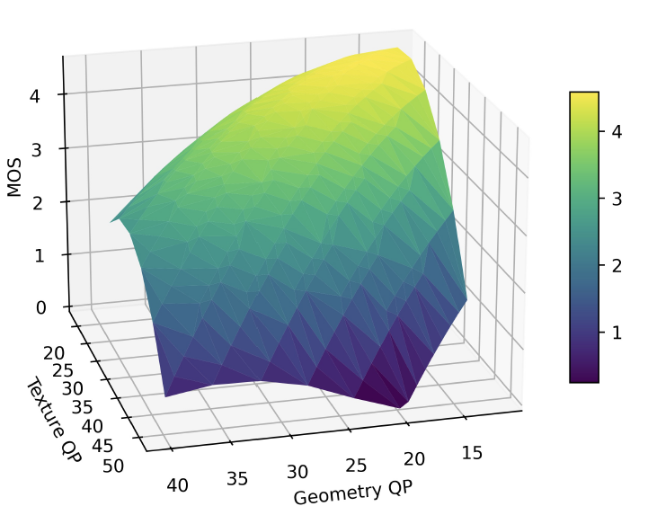
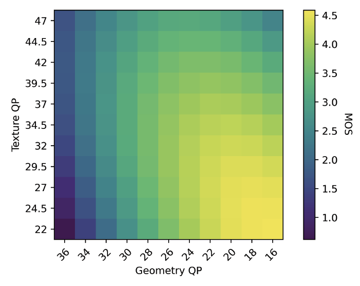

## Quality Assessment and Modeling for MPEG-V-PCC Volumetric Video


<div align="center">
  
  
</div>


To understand the impact of compression on the perceptual quality of volumetric videos, which consist of both geometry and texture components, we propose a quality of experience (QoE) model to predict the subjective quality with respect to the compression level of geometry and texture, quantifying the impact of geometry and texture compression on perceptual quality. 

To evaluate our QoE model, we collected our volumetric video quality assessment dataset and make it public. Our dataset consisting 864 ratings from 36 users on 24 video sequences. The volumetric video sequences are encoded with MPEG V-PCC using 6 different avatar models and 4 varying quality. The volumetric video sequences are then rendered into test videos for quality assessment.


## Ratings

The user ratings can be found in the file `ratings.csv` in this repo.

The file contains five columns:

- User ID: P001 to P36.
- Point Cloud Model: **loot**, **redandblack**, **soldier**, **longdress**, **basketball_player**, and **dancer**
- Geometry and Texture Compression Rate (GR, TR): **(0, 3)**, **(3.5, 1)**, **(4, 2.5)**, and **(5, 0)**
- Rating: User rating of this video


## Test Video Sequences

The 24 test video sequences can be found in the Google Drive here: 

https://drive.google.com/drive/folders/1ucxT1p8eMwo8teTUtf3_0WQRK-xwH75-?usp=sharing

The test video sequences are derived from the [8i Voxelized Full Bodies (8iVFB v2) Point Cloud Dataset](http://plenodb.jpeg.org/pc/8ilabs/) and [Owlii Dynamic Human Textured Mesh Sequence Dataset](https://mpeg-pcc.org/index.php/pcc-content-database/owlii-dynamic-human-textured-mesh-sequence-dataset/).

> - Eugene d'Eon, Bob Harrison, Taos Myers, and Philip A. Chou, "8i Voxelized Full Bodies - A Voxelized Point Cloud Dataset," ISO/IEC JTC1/SC29 Joint WG11/WG1 (MPEG/JPEG) input document WG11M40059/WG1M74006, Geneva, January 2017.
> - Yi Xu, Yao Lu, and Ziyu Wen, “Owlii Dynamic human mesh sequence dataset” ISO/IEC JTC1/SC29/WG11 m41658, 120th MPEG Meeting, Macau, October 2017.


## Citation

If you use this publicly available dataset, please cite our paper in your publication.

```
@InProceedings{
    title = "Quality Assessment and Modeling for MPEG V-PCC Volumetric Video",
    author = "Yuang Shi and Samuel Rhys Cox and May Lim and Wei Tsang Ooi",
    booktitle = "Proceedings of the 16th International Workshop on Immersive Mixed and Virtual Environment Systems (MMVE)",
    year = 2024,
    month = April,
    address = "Bari, Italy",
}
```